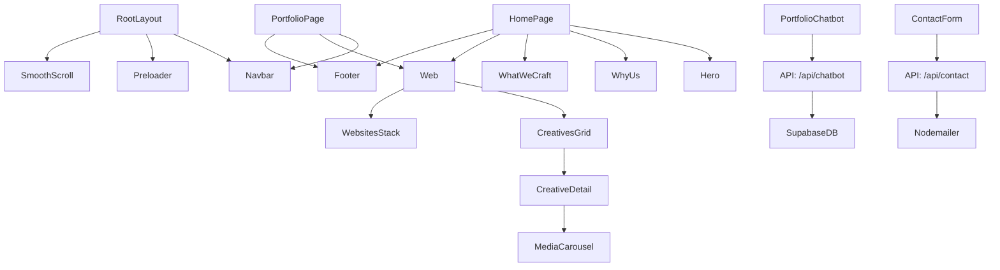
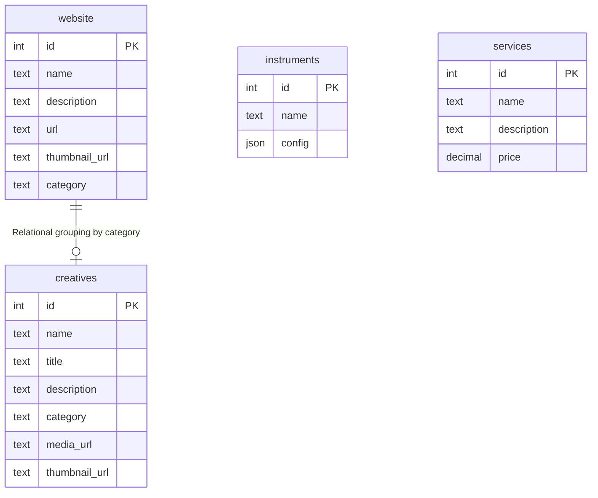

# AI-to-AI Handover: Pixelated Portfolio

This document provides a comprehensive technical overview of the Pixelated Portfolio project, a High-end Next.js and Supabase application. It is designed to allow an autonomous AI development system to resume development immediately.

---

## 1. Repository Structure

The project follows a standard Next.js App Router structure with source code located in the `src` directory.

### Core Directory Tree
```text
.
├── src/
│   ├── app/                # Next.js App Router routes and pages
│   │   ├── api/            # Serverless API routes (Chatbot, Contact)
│   │   ├── instruments/    # Instruments listing page
│   │   ├── portfolio/      # Main portfolio page
│   │   ├── services/       # Services listing page
│   │   ├── layout.js       # Root layout with Google Fonts and Preloader
│   │   └── page.js         # Homepage (Landing Page)
│   ├── components/         # React components
│   │   ├── web/            # Portfolio-specific components (Cards, Grids, Modals)
│   │   ├── Hero.jsx        # Animated landing hero with Spline 3D
│   │   ├── Navbar.jsx      # Navigation with GSAP animations
│   │   └── PortfolioChatbot.jsx # AI-powered assistant UI
│   ├── lib/                # Shared utilities and configurations
│   │   ├── supabase/       # Supabase client (client and server)
│   │   ├── animations.js   # Centralized GSAP animation patterns
│   │   └── portfolioContext.js # Knowledge base for the Chatbot
│   └── public/             # Static assets (fonts, images, SVGs)
├── .env.local              # Local environment variables
├── next.config.mjs         # Next.js configuration (transpilation, image optimization)
├── package.json            # Project dependencies and scripts
└── tailwind.config.js      # Tailwind CSS 4 configuration
```

---

## 2. Tech Stack Detection

| Technology | Purpose |
| :--- | :--- |
| **Framework** | Next.js 15 (App Router) |
| **Language** | JavaScript (ES6+), TypeScript (minimal usage) |
| **Backend** | Supabase (Database, Storage, Auth support) |
| **Auth** | Supabase SSR Helpers (Ready for implementation) |
| **Styling** | Tailwind CSS 4, Shadcn UI |
| **Animations** | GSAP 3 (ScrollTrigger, useGSAP) |
| **3D Rendering** | Spline (@splinetool/react-spline) |
| **AI Integration** | Google Generative AI (Gemini 2.5 Flash) |
| **Communication** | Nodemailer |
| **Smooth Scroll** | Lenis |
| **Fonts** | Google Fonts (Geist, Anton), Custom (Humane, Thedus) |

---

## 3. Dependency Graph



---

## 4. System Architecture Diagram

```mermaid
graph LR
    subgraph Frontend [Next.js App]
        UI[React Components]
        SA[Server Actions / Fetch]
        GSAP[GSAP Animations]
    end

    subgraph API [Next.js API Routes]
        ChatAPI[/api/chatbot]
        MailAPI[/api/contact]
    end

    subgraph External [External Services]
        Supabase[(Supabase Database)]
        Gemini[Google Gemini AI]
        SMTP[Nodemailer / Gmail]
        Spline[Spline 3D Cloud]
    end

    UI --> SA
    SA --> Supabase
    UI --> ChatAPI
    UI --> MailAPI
    UIAPI --> Gemini
    ChatAPI --> Supabase
    MailAPI --> SMTP
    UI --> Spline
```

---

## 5. Next.js Architecture

- **Router**: App Router.
- **Rendering Strategy**: Mixed. Mostly Server Components for data fetching, Client Components for animations and interactivity.
- **Layout Hierarchy**: Single `RootLayout` in `src/app/layout.js` providing global styles, fonts, and smooth scroll.
- **Middleware**: Minimal usage found in code; Supabase SSR helpers are initialized but no complex middleware logic is currently active in the root.
- **Data Fetching**: Centralized in `src/lib/fetchPortfolioData.js` using `cache` (memoization) and `unstable_cache` (revalidation every 1 hour).

---

## 6. Frontend Component Architecture

### Major Components
1. **Hero**: High-impact landing section using Spline for 3D visuals and GSAP for a background marquee.
2. **Web**: Parent component for both Website and Creative portfolio sections.
3. **CreativesGrid**: Uses a horizontal pinning effect (GSAP ScrollTrigger) to showcase creative work categories.
4. **PortfolioChatbot**: A floating assistant that uses a local knowledge base + dynamic database content to answer user queries.
5. **Navbar**: Highly animated component with a custom drawer and scroll-aware background changes.

---

## 7. Supabase Backend Architecture

### Client Setup
- `src/lib/supabase/client.js`: Browser-side client.
- `src/lib/supabase/server.js`: Server-side client for use in Server Components and API routes.

### Storage & Media
- Image optimization enabled in `next.config.mjs` for Supabase storage domains.
- Sign URLs from Supabase are used to serve media securely.

---

## 8. Database Schema

Based on current queries and data structures:



---

## 9. Authentication System

- **Status**: Infrastructure is present (`@supabase/ssr`), but active login flows are not prominent in the public portfolio view.
- **Client Initialization**: `createSupabaseServerClient` is used without complex auth middleware, suggesting an anonymous access model for the portfolio data.

---

## 10. API & Data Flow

### Chatbot Flow
1. User sends message via `PortfolioChatbot.jsx`.
2. Request hits `/api/chatbot/route.js`.
3. API fetches dynamic context from Supabase (`website`, `creatives`).
4. API combines dynamic info with `PORTFOLIO_CONTEXT` (static).
5. Sends prompt to Gemini 2.5 Flash.
6. Returns AI response.

### Contact Flow
1. User submits form.
2. Request hits `/api/contact/route.js`.
3. Validates inputs and environment variables.
4. Uses Nodemailer (Gmail) to send:
   - Notification to the agency owner.
   - Auto-reply to the user.

---

## 11. State Management

- **React State**: Local state management using `useState` and `useRef` for UI interactions and animations.
- **Context API**: `portfolioContext.js` provides a pre-defined knowledge base for the chatbot but isn't a complex state provider.
- **Zustand/Redux**: Not detected; the app relies on Next.js caching and React props.

---

## 12. Styling System

- **Core**: Tailwind CSS 4 with `@import` based configuration in `globals.css`.
- **Design Tokens**: Defined as CSS variables for spacing (`--section-px`), colors (`--red-accent`), and typography.
- **Glassmorphism**: Widely used in modals and the chatbot UI using `backdrop-blur`.

---

## 13. Environment Variables

Required variables in `.env.local`:

```bash
# Supabase
NEXT_PUBLIC_SUPABASE_URL=          # URL of your Supabase project
NEXT_PUBLIC_SUPABASE_ANON_KEY=     # Anonymous key for client-side access

# AI Integration
GEMINI_API_KEY=                    # Google Generative AI key

# Communication
EMAIL_USER=                        # Gmail address for sending emails
EMAIL_PASS=                        # App password for Gmail
EMAIL_TO=                          # (Optional) Recipient address for notifications
EMAIL_SERVICE=                     # (Optional) Defaults to 'gmail'

# Other
NEXT_PUBLIC_SITE_URL=              # Base URL for metadata
NEXT_PUBLIC_GOOGLE_VERIFICATION=   # Google Search Console tag
```

---

## 14. External Integrations

- **Google Gemini**: Powers the interactive AI chatbot.
- **Nodemailer**: Handles form submissions.
- **Spline**: Renders the 3D mascot on the hero section.
- **Lenis**: Ensures high-quality smooth scrolling experience.

---

## 15. Performance Optimization

- **Image Optimization**: Using `next/image` with Supabase remote patterns.
- **Data Caching**: Next.js Data Cache (`unstable_cache`) reduces database hits.
- **Request Memoization**: React `cache` prevents duplicate fetches within a single render tree.
- **Lazy Loading**: Spline component is dynamically imported to improve Initial Page Load.

---

## 16. Security Review

- **Client Secrets**: All sensitive keys are stored in server-side environment variables.
- **API Protection**: Basic validation in `/api/contact` and `/api/chatbot`.
- **Note**: Ensure Supabase RLS policies are strictly defined for the public schemas.

---

## 17. Deployment & Infrastructure

- **Platform**: Vercel (recommended for Next.js 15).
- **CI/CD**: Standard Vercel GitHub integration.
- **Assets**: Static assets in `public/`, dynamic assets in Supabase Storage.

---

## 18. Development Workflow

- `npm run dev`: Starts the local development server.
- `npm run build`: Generates the production build.
- `npm run lint`: Runs ESLint for code quality checks.

---

## 19. Current Feature Status

- [x] Responsive Landing Page
- [x] Portfolio Data Fetching (Supabase)
- [x] Spline 3D Integration
- [x] AI Chatbot Assistant (Gemini)
- [x] Contact Form (Nodemailer)
- [x] Portfolio Detail Modals
- [ ] Active Auth Flow (Partial Infrastructure)
- [ ] Admin Dashboard (Not found in public routes)

---

## 20. Known Issues / Technical Debt

- **Hardcoded IDs**: Some GSAP triggers rely on hardcoded IDs that might conflict if duplicate sections are added.
- **Empty Pages**: `instruments/page.jsx` and `services/page.jsx` return raw JSON for debugging.
- **Chatbot Context**: The `PORTFOLIO_CONTEXT` is a static string; moving it to a database-managed record would allow easier updates.

---

## 21. Recommended Improvements

- **Database-Driven Context**: Store chatbot system prompts in Supabase.
- **Enhanced Error Handling**: Implement more robust fallback UI for 3D scene failures.
- **Structured Logging**: Add an observability tool (e.g., Sentry) to track API failures and performance.

---

## 22. How to Continue Development

1. **Clone & Install**:
   ```bash
   npm install
   ```
2. **Environment Setup**:
   - Create `.env.local` using the template in section 13.
   - Sync the Supabase schema using the entities in section 8.
3. **Run**:
   ```bash
   npm run dev
   ```
4. **Adding Portfolio Items**:
   - Insert rows into the `website` or `creatives` tables in Supabase.
   - The UI will automatically reflect changes after the 1-hour cache revalidation or a manual revalidate tag trigger.
